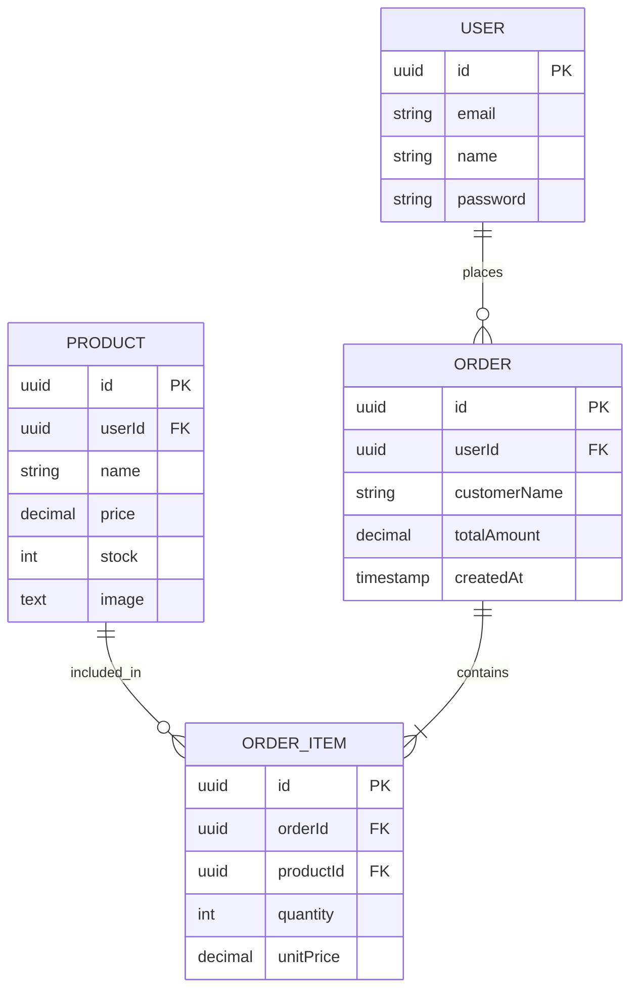

# Plataforma E-commerce Backend (Microservicios)

Este proyecto es una plataforma de e-commerce simplificada desarrollada con NestJS, implementando una arquitectura de microservicios, bases de datos relacionales (PostgreSQL) y un pipeline de CI/CD automatizado.

## 🏗️ 1. Arquitectura de la Solución

La plataforma está diseñada bajo una arquitectura de microservicios orientada a eventos síncronos (HTTP/REST) para garantizar la separación de responsabilidades, escalabilidad independiente y mantenibilidad.

- **API Gateway:** Punto de entrada único que orquesta las peticiones del frontend, maneja el enrutamiento inverso y valida los tokens JWT de forma global.
- **Auth Service:** Microservicio encargado de la autenticación y emisión de JWTs.
- **Products Service:** Gestiona el catálogo, inventario y almacenamiento de imágenes (Base64).
- **Orders Service:** Procesa las compras, verifica reglas de negocio (stock disponible) y se comunica de forma segura con el catálogo para descontar el inventario tras una orden exitosa.

## ☁️ 2. Cloud Design & DevOps

**Simulación Cloud / Despliegue:**
El proyecto está dockerizado para asegurar paridad entre entornos. Para un despliegue cloud real (Render), cada servicio operaría en su propio contenedor, escalando horizontalmente según la demanda, mientras que la base de datos usaría un servicio administrado (Neon).

**Pipeline CI/CD (GitHub Actions):**
Se configuró un flujo de integración y despliegue continuo que se dispara al integrar código a la rama `main`. El pipeline ejecuta:

1. Setup de Node.js e instalación de dependencias.
2. Ejecución de Linters para calidad de código.
3. Build de la aplicación.
4. Despliegue automatizado mediante Webhooks (Simulado para Render).
5. Generación automática de versiones (Semantic Versioning) y `CHANGELOG.md` basado en Conventional Commits.

## 🗄️ 3. Diagrama Entidad-Relación (ERD)



## 🧠 4. Decisiones Técnicas Relevantes

- Persistencia sin estado (Stateless): ➔ Las imágenes de los productos se guardan en formato Base64 directamente en la base de datos (columna text). Esto elimina la dependencia del sistema de archivos local, permitiendo que los contenedores sean verdaderamente efímeros y escalables en la nube.
- Defensa en Profundidad (Seguridad):➔ La autenticación no solo ocurre en el API Gateway. Los microservicios validan el JWT internamente y filtran las consultas a nivel de base de datos (where: { userId }) para evitar filtración de datos entre inquilinos.
- Transacciones Distribuidas (Coreografías): ➔ El orders-service inyecta el token de sesión y realiza llamadas seguras al products-service para actualizar el stock dinámicamente, validando reglas de negocio antes de persistir la orden.

## 🚀 5. Instrucciones de Instalación y Ejecución

Prerrequisitos
Node.js (v18+)

Docker y Docker Compose

PostgreSQL (si se corre fuera de Docker)

Pasos para ejecutar localmente

1. Clonar el repositorio

```bash
git clone https://github.com/nicolassanchez1/order-service.git
cd order-service
```

2. Configurar Variables de Entorno
  - Crear un archivo .env en cada microservicio basándose en el .env.example proporcionado (Credenciales de DB, Secretos JWT, Puertos).

3. Documentación de API
  - Una vez en ejecución, puedes explorar e interactuar con los endpoints usando la integración nativa de Swagger:
  * Orders API: http://localhost:3001/api
